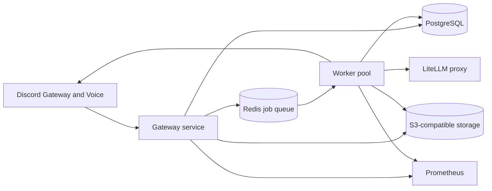

# discord-dnd-bot

discord-dnd-bot is an AI-assisted Discord bot for tabletop RPG groups. It records voice sessions, creates searchable campaign notes, supports campaign and worldbuilding management, answers lore questions, generates recaps and scene art, and sends recurring session reminders.

The application is written in Go and split into independently deployable services:

- **Gateway** maintains the Discord connection, handles slash commands, records voice audio, serves health and metrics endpoints, and enqueues slow work.
- **Worker** consumes Redis jobs, sends audio and prompts through LiteLLM, stores results in PostgreSQL and S3-compatible storage, and posts results back to Discord.

PostgreSQL, Redis, object storage, and LiteLLM are external service boundaries. This keeps the application stateless and allows each application component to scale independently in Kubernetes.

## Features

The implemented command surface includes:

- `/campaign create`, `list`, `activate`, `archive`, and `delete` (delete purges the campaign's sessions, notes, embeddings, and S3 audio — guarded by retyping the name)
- `/character add`, `list`, and `remove`
- `/world add` and `list` for NPCs, locations, factions, and quests
- `/session start`, `stop`, and `status`
- `/session list` and `/session requeue` to inspect the active campaign's sessions by status and re-run a failed/lost transcription
- Voice recording with per-speaker tracks, crash-safe PCM checkpointing to object storage, and automatic resume/reaping after a gateway restart
- Automatic transcription and AI-generated session notes
- `/roll` for dice (e.g. `2d6+3`, `d20`, `4d6kh3`) — free, instant, no AI
- `/lore` for campaign-aware worldbuilding assistance
- `/recap` for a “previously on” summary from recent completed sessions
- `/search` for lexical full-text search over completed session notes/transcripts
- `/ask` for grounded Q&A over your campaign's session notes (retrieval-augmented generation with pgvector)
- `/art` for AI-generated campaign scene art
- `/reindex` to rebuild `/ask` memory from all completed sessions
- `/remind set`, `clear`, and `show` for weekly UTC reminders
- `/notes-channel` for choosing where generated notes are posted
- `/feedback` to send feedback (stored, with an optional real-time DM to the maintainer)
- `/dm-server` to pick which allowlisted server a DM conversation uses
- `/help` for an overview or per-command details
- Public channel mentions and direct-message conversations
- Campaign context from player characters and world entities
- Prometheus metrics and Kubernetes liveness/readiness endpoints

All AI calls use LiteLLM’s OpenAI-compatible API. Provider-specific SDKs are intentionally not used in the application. Voice uses [disgo](https://github.com/disgoorg/disgo) with Discord's mandatory DAVE end-to-end voice encryption handled by the pure-Go [`thomas-vilte/dave-go`](https://github.com/thomas-vilte/dave-go) backend (no libdave/C++ toolchain required).

## Architecture



The gateway uses a `Recreate` deployment strategy because a Discord gateway connection should not be duplicated accidentally. Workers are stateless queue consumers and are configured with a separate replica count and HPA.

## Prerequisites

- Go 1.26 for local development
- CGO and `libopus-dev` for gateway voice decoding (Discord's DAVE end-to-end voice encryption is handled by the pure-Go `thomas-vilte/dave-go` backend — no libdave/C++ toolchain needed)
- PostgreSQL 13 or newer with the `pgcrypto` and `vector` (pgvector) extensions available. pgvector powers the grounded `/ask` command; the optional bundled PostgreSQL uses the official `pgvector/pgvector` image, and managed PostgreSQL (AWS RDS/Aurora, Azure Database for PostgreSQL, GCP Cloud SQL) all support pgvector.
- Redis 7 or newer
- S3, MinIO, Cloudflare R2, or another S3-compatible object store
- A LiteLLM proxy configured with chat, transcription, image, and embeddings model routes
- A Discord application with a bot token and the required gateway intents
- Docker and Helm for container or Kubernetes deployment

## Configuration

Configuration is loaded from environment variables. The same configuration is used by both services.

| Variable | Required | Default | Description |
| --- | --- | --- | --- |
| `SERVICE` | No | `gateway` | Service label: `gateway` or `worker` |
| `LOG_LEVEL` | No | `info` | `debug`, `info`, `warn`, or `error` |
| `HTTP_ADDR` | No | `:8080` | Health and metrics listener |
| `DISCORD_TOKEN` | Gateway | empty | Discord bot token |
| `DISCORD_APP_ID` | Yes | empty | Discord application ID |
| `DISCORD_GUILD_IDS` | Gateway | empty | Comma-separated guild allowlist; empty disables guild integrations and commands are never global |
| `DISCORD_GUILD_ID` | No | empty | Deprecated single-guild fallback; use `DISCORD_GUILD_IDS` |
| `DISCORD_ALLOW_DIRECT_MESSAGES` | No | `false` | **Deprecated and ignored** — DMs are always enabled; retained only so existing env still parses |
| `DISCORD_DISABLE_DAVE` | No | `false` | Set `true` to fall back to transport-only voice encryption (noop DAVE session); default keeps DAVE enabled |
| `DISCORD_FEEDBACK_DM_USER_ID` | No | (maintainer id) | Discord user ID that receives a DM on `/feedback`; empty disables the DM (feedback is still stored) |
| `DATABASE_URL` | No | empty | Full connection string. When set, takes precedence over the discrete parts below |
| `DATABASE_HOST` | No | `localhost` | DB host (used when `DATABASE_URL` is empty) |
| `DATABASE_PORT` | No | `5432` | DB port |
| `DATABASE_USER` | No | `discord_dnd_bot` | DB user |
| `DATABASE_PASSWORD` | Yes (unless `DATABASE_URL` set) | `discord_dnd_bot` | DB password — keep this in a secret |
| `DATABASE_NAME` | No | `discord_dnd_bot` | DB name |
| `DATABASE_SSLMODE` | No | `disable` | libpq sslmode |
| `DATABASE_MAX_CONNS` | No | `10` | PostgreSQL pool size |
| `DATABASE_CONN_MAX_LIFETIME` | No | `1h` | PostgreSQL connection lifetime |
| `REDIS_ADDR` | Yes | `localhost:6379` | Redis host and port |
| `REDIS_PASSWORD` | No | empty | Redis password |
| `REDIS_DB` | No | `0` | Redis database number |
| `STORAGE_ENDPOINT` | No | empty | S3 endpoint; empty uses AWS S3 |
| `STORAGE_REGION` | No | `us-east-1` | S3 region |
| `STORAGE_BUCKET` | No | `discord-dnd-bot` | S3 bucket |
| `STORAGE_ACCESS_KEY_ID` | No (use IRSA) | empty | S3 access key; leave empty to use IRSA / the default AWS credential chain |
| `STORAGE_SECRET_ACCESS_KEY` | No (use IRSA) | empty | S3 secret key; leave empty to use IRSA |
| `STORAGE_USE_PATH_STYLE` | No | `true` | Required by MinIO and many S3-compatible services |
| `LITELLM_BASE_URL` | Yes | `http://litellm:4000` | LiteLLM proxy URL |
| `LITELLM_API_KEY` | Yes when configured | empty | LiteLLM API key |
| `LITELLM_CHAT_MODEL` | No | `dnd-chat` | Default LiteLLM chat route (fallback for the per-task routes below) |
| `LITELLM_NOTES_MODEL` | No | falls back to chat | Model for session-note generation |
| `LITELLM_RECAP_MODEL` | No | falls back to chat | Model for `/recap` |
| `LITELLM_LORE_MODEL` | No | falls back to chat | Model for `/lore` |
| `LITELLM_ASK_MODEL` | No | falls back to chat | Model for grounded `/ask` |
| `LITELLM_TRANSCRIBE_MODEL` | No | `voice-transcribe` | LiteLLM transcription route |
| `LITELLM_IMAGE_MODEL` | No | `dnd-image` | LiteLLM image route |
| `LITELLM_EMBED_MODEL` | No | `dnd-embed` | LiteLLM embeddings route (grounded `/ask` retrieval) |
| `LITELLM_EMBED_DIM` | No | `1536` | Embedding vector dimensionality; must match the embed model (sizes the pgvector column) |
| `LITELLM_REQUEST_TIMEOUT` | No | `120s` | AI request timeout |
| `LITELLM_UPLOAD_TIMEOUT` | No | `300s` | Timeout for multipart audio uploads |
| `AUDIO_SILENCE_TRIM` | No | `true` | Drop near-silent frames before upload to cut billed minutes |
| `AUDIO_SILENCE_RMS_THRESHOLD` | No | `350` | Per-frame RMS (0–32767) treated as silence |
| `AUDIO_TRANSCRIBE_SEGMENT_MINUTES` | No | `3` | Split each speaker's track into ≤ this many minutes per WAV segment (downmixed to mono) when transcribing, bounding worker and STT memory (`0` = whole track in one request) |
| `WORKER_CONCURRENCY` | No | `4` | Jobs processed in parallel per worker pod |
| `WORKER_TRANSCRIBE_JOB_TIMEOUT` | No | `4h` | Max time for a single transcribe+summarize job (CPU Whisper runs below realtime) |
| `WORKER_JOB_TIMEOUT` | No | `15m` | Max time for non-transcribe jobs (art, reindex) |
| `WORKER_MAX_RETRIES` | No | `3` | Times a job is requeued after a transient failure before it is abandoned (`0` = no retries; permanent failures are never retried) |

Each chat endpoint (notes, recap, lore, ask) can point at a different LiteLLM
route, so operators can pick the cheapest capable model per task purely through
`values.yaml`/env — no code changes. Empty per-task values fall back to
`LITELLM_CHAT_MODEL`.

The database schema is embedded in the binaries and applied idempotently at startup by the gateway and worker.

### Grounded Q&A with `/ask` (RAG)

`/ask` answers a player's question using only the campaign's own session notes,
via retrieval-augmented generation:

1. When a session completes, the worker splits its AI-generated notes into
   passages, embeds each with `LITELLM_EMBED_MODEL`, and stores the vectors in
   the `session_embeddings` table (pgvector).
2. On `/ask`, the gateway embeds the question, retrieves the most similar
   passages for the active campaign by cosine distance (`embedding <=> query`),
   and passes those excerpts to `LITELLM_ASK_MODEL` with instructions to answer
   only from them (and to say so when the answer isn't in the notes).

This differs from `/search`, which is lexical full-text (`tsvector`) matching
and returns snippets rather than a synthesized answer.

Requirements:

- **pgvector.** The `vector` extension must be available; the app runs
  `CREATE EXTENSION IF NOT EXISTS vector` on startup. The bundled Helm
  PostgreSQL uses a pgvector-capable image; managed PostgreSQL services support
  it too.
- **An embeddings route in LiteLLM** named to match `LITELLM_EMBED_MODEL`
  (default `dnd-embed`), e.g. OpenAI `text-embedding-3-small` or Amazon Titan
  Embed v2 via Bedrock.
- **`LITELLM_EMBED_DIM` must match that model's output dimension** (1536 for
  `text-embedding-3-small`, 3072 for `-3-large`, 1024 for Titan v2). It sizes
  the pgvector column at first migration. Changing it after data exists requires
  re-embedding: drop `session_embeddings` rows (or the table) and reprocess.

Only sessions completed *after* embeddings were enabled are indexed; historical
notes are picked up as new sessions are recorded (or by re-running processing).

### External Secrets

The Helm chart can populate the application Secret with [External Secrets Operator](https://external-secrets.io/). Install its CRDs and configure a `SecretStore` or `ClusterSecretStore` first, then set `secrets.externalSecret.enabled`. Do not set `secrets.existingSecret` in this mode.

```yaml
secrets:
  create: false
  externalSecret:
    enabled: true
    refreshInterval: 1h
    secretStoreRef:
      name: production-secrets
      kind: ClusterSecretStore
    target:
      name: discord-dnd-bot-secrets
      creationPolicy: Owner
    data:
      - secretKey: DISCORD_TOKEN
        remoteRef: {key: discord-dnd-bot/production, property: discord_token}
      - secretKey: DATABASE_PASSWORD
        remoteRef: {key: discord-dnd-bot/production, property: database_password}
      - secretKey: LITELLM_API_KEY
        remoteRef: {key: discord-dnd-bot/production, property: litellm_api_key}
      # Add only if needed:
      #   REDIS_PASSWORD               (bundled/managed Redis with auth on)
      #   STORAGE_ACCESS_KEY_ID / STORAGE_SECRET_ACCESS_KEY  (non-IRSA S3)
      #   DATABASE_URL instead of DATABASE_PASSWORD (managed DB, full URL secret)
```

The target Secret must provide `DISCORD_TOKEN`, `LITELLM_API_KEY`, and the DB credential (`DATABASE_PASSWORD`, or a full `DATABASE_URL` when `config.database.url` is set). The gateway and worker start only after the ExternalSecret controller has created it.

## Discord Access Control

Configure `DISCORD_GUILD_IDS` with every permitted server ID. The gateway registers guild-scoped commands only in the listed servers and ignores unlisted guilds, even when the bot is installed there. (DM-capable commands are registered as global commands with DM interaction contexts so they also work in direct messages.) Direct messages are always enabled: a DM from a user who belongs to exactly one allowlisted server uses that server's active campaign automatically; a user in more than one must pick one with `/dm-server` (an ambiguous DM is answered with a prompt to run it).

Also disable **Public Bot** in the Discord Developer Portal under **Bot**. That prevents people outside your application team from installing the bot through an OAuth2 URL; the runtime allowlist remains the second line of defense.

## Local Development

Install Go and the system Opus development package, then run:

```bash
sudo apt-get update
sudo apt-get install -y libopus-dev pkg-config

export CGO_ENABLED=1
go mod download
go test ./...
go vet ./...
go build ./...
```

The repository also supports the devcontainer in `.devcontainer/`. When Git metadata is owned by another user in a container, add `-buildvcs=false` to Go build, test, or vet commands.

Run a service with its environment configured:

```bash
CGO_ENABLED=1 go run ./cmd/gateway
CGO_ENABLED=1 go run ./cmd/worker
```

The HTTP server exposes:

- `GET /healthz` for process liveness
- `GET /readyz` for dependency readiness
- `GET /metrics` for Prometheus scraping

## Docker

The multi-stage Dockerfile builds one service binary per image. The gateway and worker use separate tags so they can be deployed and scaled independently:

```bash
docker build --build-arg SERVICE=gateway -t discord-dnd-bot-gateway:dev .
docker build --build-arg SERVICE=worker -t discord-dnd-bot-worker:dev .
```

The runtime image uses Debian slim, includes the Opus runtime and CA certificates, and runs as non-root UID `10001`.

## Kubernetes and Helm

The application chart is in [`charts/discord-dnd-bot`](charts/discord-dnd-bot). It deploys the stateless gateway and worker services and expects PostgreSQL, Redis, S3-compatible storage, and LiteLLM to be supplied externally or by their own charts.

Lint and render it locally:

```bash
helm lint charts/discord-dnd-bot
helm template discord-dnd-bot charts/discord-dnd-bot
```

Install with an existing Kubernetes Secret:

```bash
helm upgrade --install discord-dnd-bot charts/discord-dnd-bot \
  --namespace discord-dnd-bot \
  --create-namespace \
  --set config.discord.appID="$DISCORD_APP_ID" \
  --set config.database.url="postgres://..." \
  --set config.redis.addr="redis.example:6379" \
  --set secrets.existingSecret=discord-dnd-bot-runtime
```

The existing Secret must contain these keys:

- `DISCORD_TOKEN`
- `DATABASE_PASSWORD` (or `DATABASE_URL` when you set `config.database.url`)
- `LITELLM_API_KEY`
- `REDIS_PASSWORD` — only if Redis requires auth
- `STORAGE_ACCESS_KEY_ID` / `STORAGE_SECRET_ACCESS_KEY` — only for non-IRSA S3

For development, the chart can create the Secret from values instead. For production, use an external secret manager or a pre-created Secret rather than storing credentials in Helm values.

The gateway and worker have independent `replicaCount`, resource, node selector, affinity, toleration, and autoscaling settings. Worker autoscaling defaults to 1–5 replicas based on CPU utilization. Queue depth is exported as a Prometheus gauge, so queue-depth autoscaling can be added with KEDA without changing the worker code or gateway deployment.

Enable Prometheus Operator scraping with:

```bash
helm upgrade --install discord-dnd-bot charts/discord-dnd-bot \
  --set serviceMonitor.enabled=true
```

### Grafana dashboard

A ready-made dashboard lives at [`charts/discord-dnd-bot/dashboards/discord-dnd-bot.json`](charts/discord-dnd-bot/dashboards/discord-dnd-bot.json). It covers everything the app exports:

- **Overview** — targets up, command rate, command error rate, approximate queue backlog.
- **Commands** — rate and errors by command, latency (p50/p90/p99), totals table.
- **Jobs & Queue** — enqueued vs processed throughput, failures, processing latency (p90/p99), and approximate backlog by job type (transcription/art/reindex).
- **AI / LiteLLM** — request rate and error rate by kind (chat/transcribe/image/embed), plus a totals table (a rough proxy for spend by model type).
- **Runtime & Resources** — memory, goroutines, and CPU per pod.

It has `datasource` and `job` template variables, so it adapts to any Prometheus and multi-service setups. Two ways to install:

1. **Manual import** — in Grafana, Dashboards → New → Import → upload the JSON (or paste it), then pick your Prometheus data source.
2. **Sidecar auto-discovery** — if your Grafana runs the dashboard sidecar (kube-prometheus-stack or the Grafana Helm chart), let this chart ship it as a labeled ConfigMap:

   ```bash
   helm upgrade --install discord-dnd-bot charts/discord-dnd-bot \
     --set serviceMonitor.enabled=true \
     --set grafanaDashboard.enabled=true
   ```

   The sidecar label defaults to `grafana_dashboard: "1"`; override `grafanaDashboard.sidecarLabel`/`sidecarLabelValue` (and optionally `folder`) to match your Grafana.

The dashboard needs the app's `/metrics` scraped — use `serviceMonitor.enabled=true` (Prometheus Operator) or the `prometheus.io/scrape` pod annotations the chart already sets.


By default the chart deploys only the stateless gateway and worker and expects PostgreSQL, Redis, object storage, and LiteLLM to be supplied externally. For evaluation or self-hosting, it can also deploy PostgreSQL and Redis as plain in-chart manifests (no third-party subcharts — nothing to `helm dependency build`):

```bash
helm upgrade --install discord-dnd-bot charts/discord-dnd-bot \
  --set postgresql.enabled=true \
  --set redis.enabled=true
```

The bundled PostgreSQL uses the official [`pgvector/pgvector`](https://hub.docker.com/r/pgvector/pgvector) image, so the `vector` extension that `/ask` needs is always present (the app runs `CREATE EXTENSION IF NOT EXISTS vector` on startup). When enabled, the chart **auto-wires** `DATABASE_HOST` to the bundled PostgreSQL Service and `REDIS_ADDR` to the bundled Redis Service — both derived from the release/`fullnameOverride`, so renaming the release renames the services and the connection targets together (no manual sync). The DB password lives once in the app Secret as `DATABASE_PASSWORD`, which the bundled PostgreSQL also consumes. Set `config.database.host` / `config.redis.addr` explicitly only to point at an external/managed instance (an explicit value always wins).

Nothing in the app pins a PostgreSQL major version — any PostgreSQL 13+ with pgvector works. Set `postgresql.image.tag` to `pg13`…`pg17` as desired. For production, prefer managed PostgreSQL (with pgvector) and Redis and leave both disabled.

### Provisioning the S3 bucket with ACK

If you run on AWS with the [AWS Controllers for Kubernetes (ACK) S3 controller](https://aws-controllers-k8s.github.io/community/docs/community/services/) installed, the chart can create and reconcile the bucket the bot needs declaratively. Enable it with `s3.enabled=true`:

```bash
helm upgrade --install discord-dnd-bot charts/discord-dnd-bot \
  --set s3.enabled=true \
  --set config.storage.bucket=my-dnd-bucket
```

This emits an `s3.services.k8s.aws/v1alpha1 Bucket` resource. The bucket name defaults to `config.storage.bucket` (the same name the app reads/writes), so the two stay aligned. By default the bucket is created private (all public access blocked), with SSE-S3 (`AES256`) encryption and a `retain` deletion policy so the AWS bucket survives if the resource is deleted.

Requirements and notes:

- The ACK S3 controller must be installed and have IAM permissions (typically via IRSA on its ServiceAccount) to create and manage buckets.
- Leave `s3.enabled=false` (the default) for MinIO, Cloudflare R2, or any non-AWS S3-compatible endpoint (`config.storage.endpoint` set) — those are not managed by ACK.
- Optional `s3` values allow SSE-KMS (`s3.encryption.kmsKeyID`), object versioning (`s3.versioning`), CORS rules (`s3.cors`), lifecycle rules (`s3.lifecycle`, e.g. to expire old session audio), and extra tags (`s3.extraTags`). See [`values.yaml`](charts/discord-dnd-bot/values.yaml).
- Grant the gateway/worker pods access to the bucket via IRSA (annotate `serviceAccount`) or `STORAGE_ACCESS_KEY_ID` / `STORAGE_SECRET_ACCESS_KEY` credentials, exactly as when the bucket is provisioned outside the chart.

#### IAM role via ACK (IRSA, no static credentials)

If you also run the [ACK IAM controller](https://aws-controllers-k8s.github.io/community/docs/community/services/), the chart can provision an IAM role and policy scoped to the bucket and wire it onto the pods' ServiceAccount automatically — so you don't need `STORAGE_ACCESS_KEY_ID` / `STORAGE_SECRET_ACCESS_KEY` at all:

```bash
helm upgrade --install discord-dnd-bot charts/discord-dnd-bot \
  --set s3.enabled=true \
  --set s3.iam.enabled=true \
  --set config.storage.bucket=my-dnd-bucket \
  --set aws.accountId=123456789012 \
  --set eks.oidcProvider=oidc.eks.us-east-1.amazonaws.com/id/EXAMPLED539D4633E53DE1B716D3041E
```

This emits `iam.services.k8s.aws/v1alpha1` `Role` and `Policy` resources (named `<release>-discord-dnd-bot-s3`). The policy grants `s3:GetObject`, `s3:PutObject`, `s3:DeleteObject`, and `s3:ListBucket` on the provisioned bucket only. The role trusts the chart's ServiceAccount through the cluster OIDC provider, and its ARN is added to the ServiceAccount as `eks.amazonaws.com/role-arn`, so the running pods assume it via IRSA.

Requirements:

- The ACK IAM controller must be installed with permissions to manage IAM roles/policies.
- `serviceAccount.create=true` (the default).
- `aws.accountId` and `eks.oidcProvider` (the OIDC issuer host + path, without the `https://` scheme) must be set — the chart fails rendering with a clear message if they are missing.

With IRSA in place, leave `STORAGE_ACCESS_KEY_ID` / `STORAGE_SECRET_ACCESS_KEY` empty; the AWS SDK in `internal/storage` falls back to the pod's IRSA credentials automatically.

## Scalability and Cost

The bot is designed to scale gracefully in and out on Kubernetes:

- **Worker in-pod concurrency** — each worker pod processes `WORKER_CONCURRENCY`
  jobs in parallel via a bounded goroutine pool. On `SIGTERM` the pod stops
  dequeuing and drains in-flight jobs before exiting, so a scale-in or rolling
  update never drops a transcription mid-flight (`terminationGracePeriodSeconds`
  is sized for the slowest single job).
- **Per-endpoint model selection** — notes, recap, lore, and ask each resolve to
  their own LiteLLM route (with fallback to the default chat route), so the
  cheapest capable model can be chosen per task from `values.yaml`.
- **Silence trimming** — near-silent audio frames are dropped before upload
  (`AUDIO_SILENCE_TRIM`), reducing the minutes billed by the transcription model
  without degrading speech.
- **Segmented, mono transcription** — each speaker's track is transcribed in
  bounded WAV segments (`AUDIO_TRANSCRIBE_SEGMENT_MINUTES`, downmixed to mono),
  streamed one segment at a time. This keeps both worker and STT peak memory flat
  regardless of how long the session runs, so a multi-hour recording won't OOM.
- **At-least-once retries** — a job that fails transiently (a LiteLLM/storage
  blip, or the worker being killed mid-job) is requeued up to `WORKER_MAX_RETRIES`
  times; permanent failures (no audio, empty transcript) are not retried. A lost
  transcription can also be re-run manually with `/session requeue`, since the
  raw audio chunks persist in object storage.
- **Participant tracking** — the gateway records which Discord users spoke
  (disgo resolves each voice packet's SSRC to a user) into `session_participants`.
  Session notes are told *when* the session occurred and *who* was in the call,
  and `/session status` shows who has been heard so far.

### Mapping logical routes to your LiteLLM inventory

Each `LITELLM_*_MODEL` value must equal the **public model name** of a route that
exists in your LiteLLM deployment. You can either create logical aliases in
LiteLLM (`dnd-chat`, `dnd-image`, …) or point the values directly at concrete
model ids you already have.

Example mapping against a real Bedrock + OpenAI inventory:

| Logical purpose | Env var | Example model in LiteLLM | Notes |
| --- | --- | --- | --- |
| Default chat | `LITELLM_CHAT_MODEL` | `claude-4-5-sonnet` | Bedrock Claude Sonnet 4.5 |
| Session notes | `LITELLM_NOTES_MODEL` | `claude-opus-4-5` | Stronger model for long summaries |
| Recap | `LITELLM_RECAP_MODEL` | `claude-4-5-haiku` | Cheapest capable model |
| Lore | `LITELLM_LORE_MODEL` | `claude-4-5-sonnet` | |
| Ask (RAG) | `LITELLM_ASK_MODEL` | `claude-4-5-sonnet` | |
| Embeddings | `LITELLM_EMBED_MODEL` | `amazon-titan-embed-text-v2:0` | Bedrock Titan Embed V2 |
| Image | `LITELLM_IMAGE_MODEL` | `gpt-image-2` (OpenAI) | See note below |
| Transcription | `LITELLM_TRANSCRIBE_MODEL` | `whisper-1` (OpenAI) | **Must be added — see below** |

Anthropic Claude on Bedrock (Haiku/Sonnet/Opus 4.x) covers every chat/summary
task, and `amazon-titan-embed-text-v2:0` covers embeddings.

### Image generation

Bedrock image models (Titan Image, Stable Diffusion, Nova Canvas) are only
usable if they're **enabled in your account and added to LiteLLM**. If your
LiteLLM inventory only exposes OpenAI image models (`gpt-image-1`, `gpt-image-2`),
point `LITELLM_IMAGE_MODEL` at one of those instead.

### Speech-to-text — you must add a model

Bedrock has **no speech-to-text model**, and LiteLLM's `/audio/transcriptions`
endpoint does not support the `bedrock` or `sagemaker` providers (as of the
current LiteLLM release its supported STT providers are `openai, azure,
vertex_ai, gemini, deepgram, groq, fireworks_ai, ovhcloud, mistral`). AWS's own
speech-to-text service, **Amazon Transcribe**, is a *separate* service from
Bedrock with a non-OpenAI-compatible API, so it cannot be wired through LiteLLM
without a custom adapter in the worker.

There is **no transcription route in the current inventory**, so `/session`
transcription will fail until you add one. Add a route to your LiteLLM config
and set `LITELLM_TRANSCRIBE_MODEL` to its public name. Recommended options:

| Provider | LiteLLM `model` | Notes |
| --- | --- | --- |
| OpenAI | `whisper-1` | Simple, widely available |
| Deepgram | `deepgram/nova-2` | Strong multi-speaker/diarization |
| Groq | `groq/whisper-large-v3` | Cheapest/fastest Whisper |
| Fireworks / Mistral | `fireworks_ai/...`, `mistral/voxtral-...` | OpenAI-compatible |

Minimal LiteLLM `config.yaml` addition (OpenAI Whisper):

```yaml
model_list:
  - model_name: whisper-1
    litellm_params:
      model: whisper-1
      api_key: os.environ/OPENAI_API_KEY
    model_info:
      mode: audio_transcription
```

> **Note on Amazon Nova Sonic.** The Bedrock catalog lists Nova Sonic as
> "speech-to-text," but it is a *real-time, bidirectional speech-to-speech*
> model (a persistent event stream for live voice assistants), **not** a batch
> file-in/transcript-out API. LiteLLM's `/audio/transcriptions` endpoint also
> does not support Bedrock at all. This bot transcribes a finished `.wav`
> asynchronously, so Nova Sonic cannot be used here without a custom streaming
> adapter. (Unrelated naming: **Deepgram Nova-2**, `deepgram/nova-2`, *is* a
> supported batch STT model and a good fit.)

### Self-hosted speech-to-text (no external STT provider, no GPU)

If you don't have an external STT provider, the Helm chart can run an
OpenAI-compatible Whisper server in-cluster as a separate, independently-scaled
deployment. It runs on **CPU-only (GPU-less) EC2 instances** — transcription
here is an async background job, so real-time latency isn't required (a job may
take minutes and that's fine).

It uses [Speaches](https://github.com/speaches-ai/speaches), a community
container built on `faster-whisper` (CTranslate2) that exposes
`POST /v1/audio/transcriptions`.

Enable it in `values.yaml`:

```yaml
stt:
  enabled: true
  model: "Systran/faster-whisper-medium"  # chart default; swap to -small / -large-v3 freely
  resources:
    requests: { cpu: "4", memory: 8Gi }
    limits:   { cpu: "4", memory: 8Gi }
  persistence:
    enabled: true       # caches model weights across restarts (RWO PVC)
    size: 5Gi
```

Transcription requests are already bounded to `AUDIO_TRANSCRIBE_SEGMENT_MINUTES`
of mono audio each (see [Scalability](#scalability-and-cost)), which keeps the
STT server's peak memory flat regardless of session length. If you still see the
STT pod OOM on a very heavy talker, lower `AUDIO_TRANSCRIBE_SEGMENT_MINUTES` or
raise `stt.resources`.

Then register the in-cluster service as your transcription route in LiteLLM's
`config.yaml` (Speaches is OpenAI-compatible, so use the `openai/` prefix and
point `api_base` at the Service DNS name):

```yaml
model_list:
  - model_name: voice-transcribe
    litellm_params:
      model: openai/Systran/faster-whisper-medium
      api_base: http://<release>-discord-dnd-bot-stt:8000/v1
      api_key: "none"
    model_info:
      mode: audio_transcription
```

The `model:` here must match the model the `stt` deployment loads
(`stt.model`). Leave `config.litellm.transcribeModel` as `voice-transcribe` (its
public name).

**CPU sizing guidance** (approximate real-time factor; RTF < 1.0 = faster than
real-time, so a 1-hour session finishes in `RTF × 60 min`):

| Model | CPU request | RTF (a few vCPUs) | Quality |
| --- | --- | --- | --- |
| `faster-whisper-small` | 1–2 | ~0.3–0.7× | Good |
| `faster-whisper-medium` | 2–4 | ~0.7–1.5× | Better (chart default) |
| `faster-whisper-large-v3` | 4+ | ~1.5–3× | Best (heavy) |

Scale it like the other services: bump `stt.replicaCount` or enable
`stt.autoscaling` (CPU-based HPA). Because model weights live on a single
ReadWriteOnce PVC, the deployment uses a `Recreate` strategy; for multiple
replicas either disable persistence (each pod re-downloads to an `emptyDir`) or
provide a ReadWriteMany StorageClass.

## CI and Security

GitHub Actions workflows are under [`.github/workflows`](.github/workflows):

- `ci.yml` runs Go formatting/linting, `go vet`, race-enabled tests, coverage generation, Codecov upload, `govulncheck`, and `gosec` SARIF reporting.
- `docker.yml` builds gateway and worker images, scans them with Trivy for high and critical vulnerabilities, uploads SARIF results, and pushes images to GHCR for branch and tag builds.
- `helm.yml` lints and renders the chart and validates rendered Kubernetes manifests with Kubeconform.

The default image names are:

```text
ghcr.io/stephencshelton/discord-dnd-bot:gateway-<tag>
ghcr.io/stephencshelton/discord-dnd-bot:worker-<tag>
```

Set `CODECOV_TOKEN` as a repository secret if private coverage reporting is required. The workflow does not fail solely because Codecov is unavailable.

## Project Layout

```text
cmd/gateway          Discord gateway process
cmd/worker           asynchronous AI job worker
internal/audio       voice decoding, mixing, and WAV encoding
internal/config      environment-backed configuration
internal/db          PostgreSQL connection and data access
internal/dice        dice-notation parser and roller
internal/gateway     Discord commands, handlers, voice, and reminders
internal/httpserver   health, readiness, and Prometheus endpoints
internal/litellm     OpenAI-compatible LiteLLM client
internal/queue       Redis-backed job queue
internal/storage     S3-compatible object storage client
internal/worker      transcription, summarization, and art jobs
charts/discord-dnd-bot    Kubernetes Helm chart
```

## License

Released under the [MIT License](LICENSE).
